# 缘起

我对单独的指令更感兴趣，本来感觉 Tensor Core 探索也比较有意义，不过终究自己没有硬件。再加上本课程主要介绍 x86 指令集，我决定探究 x86 中的一条指令。我比较想研究较新的指令集，比如 AVX-512 非常有意思，然而支持 AVX-512 的**消费级**处理器很少，根据 [Wikipedia](https://en.wikipedia.org/wiki/AVX-512)，目前只有 Intel 11 代（Rocket Lake）桌面端和 10 代（Ice Lake）、11 代（Tiger Lake）移动端，而 12 代（Alder Lake）取消了官方支持，需要一些非常规操作。AMD 的 Zen 4 虽然支持，但才刚上市。因此我放弃了 AVX-512。

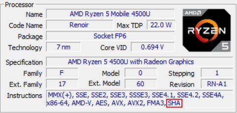

观察我基于 Zen 2 的笔记本支持的指令集扩展，发现最后一个是 **SHA 扩展**。而且上学期学了密码学，很自然地成为我的考虑对象。SHA 扩展最早由 Intel 提出，包含 4 条 SHA-1 加速指令和 3 条 SHA-256 加速指令。根据 [Wikipedia](https://en.wikipedia.org/wiki/Intel_SHA_extensions)，从 Intel Goldmont（Atom）、Ice Lake（移动端）和 Rocket Lake（桌面端）**开始支持**（好像也没比 AVX-512 广泛多少），AMD 从 Zen 开始支持，支持*相对*比较广泛。

在探索过程中，我决定至少实现 SHA 加速和指令微基准测试（microbenchmark，我主要关注指令延迟和吞吐率）。加速代码参考了不少框架，主要包括 [sha256-simd](https://github.com/minio/sha256-simd)、OpenSSL 以及 Linux 内核 crypto 子系统等实现。在微基准测试中，则主要参考了 [instbench](https://github.com/umezawatakeshi/instbench)、[nanoBench](https://github.com/andreas-abel/nanoBench) 以及其提供的[测试结果](https://www.uops.info/table.html)，最后花费了更多的时间。

# 安全哈希算法（SHA）及加速

## 简介

SHA-1 是 MD5 的继任者，因此其填充方式是相同的，都包含了 64 位的消息长度，而块大小也都是 64 字节。不过 SHA-1 的摘要长度从 MD5 的 128 位扩展到 160 位。SHA-1 在目前已经是不安全的，不仅是理论上如此，[SHAttered 攻击](https://shattered.io/)也在实际上构造出了冲突，尽管攻击成本非常高。因此，最好不要再使用 SHA-1 了，然而很多文件完整性校验、Git 等仍然使用它。

SHA-1 的继任者是 SHA-2，包含 SHA-256、SHA-384 和 SHA-512 等多种变种，其中 SHA-256 使用最为广泛，SHA 指令扩展实现的就是 SHA-256。SHA-2 的分块与之前仍然保持一致，顾名思义，SHA-256 的摘要是 256 位长。著名的 Bitcoin 就使用了 SHA-256 作为 PoW 算法，Git 也实验性支持 SHA-256。

本实验主要关注 SHA-256。

## 实现

由于填充与性能关系不大，这里只介绍 SHA-256 的块处理。根据 [Intel SHA 扩展文档](https://www.intel.com/content/www/us/en/developer/articles/technical/intel-sha-extensions.html)，处理过程包括消息扩展和 64 轮迭代。

### 消息扩展

消息扩展的伪代码如下：

```
For i=0 to 63
    If (0 <= i <= 15)
		W[i] = M[i]
	Else
		W[i] = s1(W[i-2]) + W[i-7] + s0(W[i-15]) + W[i-16]
```

其中 M 为消息，s0、s1 为位运算函数。

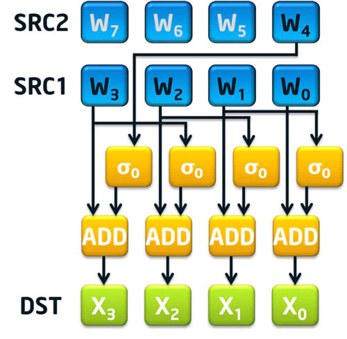

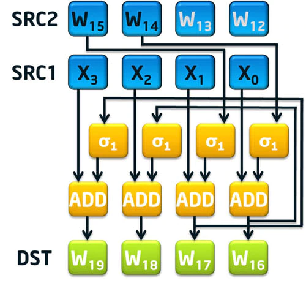

可以发现，两条指令只加速了 16 <= i <= 63 的部分。其中 `SHA256MSG1` 计算了上面的表达式的后半部分，即 `s0(W[i-15]) + W[i-16]`；而 `SHA256MSG2` 加上了 `s1(W[i-2])` 项。而 `W[i-7]` 项需要手动加上，这可能是因为 `W[i-7]` 距离 `W[i]` 和 `W[i-2]` 比较远。

### 迭代部分

迭代部分的伪代码如下：

```
For i=0 to 63
    T1 = H + S1(E) + Ch(E,F,G) + K[i] + W[i]
	T2 = S0(A) + Maj(A,B,C)
	H  = G
	G  = F
	F  = E
	E  = D + T1
	D  = C
	C  = B
	B  = A
	A  = T1 + T2
```

其中 A,B,C,D,E,F,G,H 为 32 位的临时寄存器，K 为一个长度为 64 的常量数组，S0、S1、Ch、Maj 为位运算函数。

`SHA256RNDS2` 指令进行两轮迭代操作，需要在 xmm0 中提供两轮所需的 `K[i] + W[i]`，8 个临时寄存器保存在两个 xmm 寄存器中。比较特别的是，本来结果也需要写回两个 xmm 寄存器，但是由于 SHA-2 的性质，两轮后恰好有一个 xmm 寄存器不需要修改，所以就只需要写回一个 xmm 寄存器。

### 指令细节

根据后来学习的指令编码规则，我注意到 SHA-256 指令的 opcode 为 `0F 38 CB`（或 `CC`、`CD`），是经过了两次扩展（转义）的。因此，SHA 指令扩展显然是很后来才加入的。

# 使用SHA指令扩展加速

经过上面的解释，SHA 指令扩展显然需要其他指令的配合才能发挥作用，包括 SSE/AVX 等 SIMD 指令。但由于我不太熟悉 SIMD 指令，而且很多我找到的实现都多少要用 Perl 生成汇编代码，或者用了神奇的 Go 汇编，实在是不太好理解，所以最终我决定直接用 Linux 内核的实现，并进行简单解释。它虽然也需要 Perl 生成汇编代码，但是我手工替换一下变量，就能直接用 GCC 汇编了。

## 核心代码

使用 SHA 指令扩展加速的 SHA-256 代码位于 `arch/x86/crypto/sha256_ni_asm.S`，似乎是 Intel 提供的。其中实现了 `sha256_ni_transform` 函数，其原型如下：

```cpp
void sha256_ni_transform(uint32_t *digest, const void *data,
	uint32_t numBlocks);
```

根据 SYSV ABI，这三个参数分别保存在 rdi、rsi、rdx 寄存器中。其中 `digest` 是一个长度为 8 的数组，保存了 SHA-256 的摘要，`data` 保存了整数块数据，`numBlocks` 是需要处理的块数量。

```asm
	/*
	 * load initial hash values
	 * Need to reorder these appropriately
	 * DCBA, HGFE -> ABEF, CDGH
	 */
	movdqu		0*16(%rdi), %xmm1
	movdqu		1*16(%rdi), %xmm2

	pshufd		$0xB1, %xmm1,  %xmm1		/* CDAB */
	pshufd		$0x1B, %xmm2,  %xmm2		/* EFGH */
	movdqa		%xmm1, %xmm7
	palignr		$8, %xmm2,  %xmm1		/* ABEF */
	pblendw		$0xF0, %xmm7, %xmm2		/* CDGH */
```

这部分代码从 `digest` 中读取初始的摘要，然后将其保存在 xmm 寄存器中，并调整为正确的顺序。

```asm
	/* Rounds 0-3 */
	movdqu		0*16(%rsi), %xmm0
	pshufb		%xmm8, %xmm0
	movdqa		%xmm0, %xmm3
		paddd		0*16(%rax), %xmm0
		sha256rnds2	%xmm1, %xmm2
		pshufd 		$0x0E, %xmm0, %xmm0
		sha256rnds2	%xmm2, %xmm1
```

前 16 轮的处理比较简单，W 就是原始消息，只要加上 K 即可进行迭代。值得注意的是，消息扩展和迭代是一起进行的，而且为了提高效率，把所有轮数都循环展开了。首先需要将消息放入 xmm0，并调整字节序（PSHUFFLE_BYTE_FLIP_MASK），xmm3 到 xmm7 都用于暂存以便后面的 SHA256MSG 使用。接下来加上 K，调用 `SHA256RNDS2` 进行两轮，再将 xmm0 的高 32 位移动到低 32 位，再调用 `SHA256RNDS2` 进行两轮。因为 128 位的 xmm0 可以保存四轮的数据。

另外，额外缩进的代码是处理迭代的，而不缩进的代码是做消息扩展的。

```asm
	/* Rounds 4-7 */
	movdqu		1*16(%rsi), %xmm0
	pshufb		%xmm8, %xmm0
	movdqa		%xmm0, %xmm4
		paddd		1*16(%rax), %xmm0
		sha256rnds2	%xmm1, %xmm2
		pshufd 		$0x0E, %xmm0, %xmm0
		sha256rnds2	%xmm2, %xmm1
	sha256msg1	%xmm4, %xmm3
```

这里多了一个 `SHA256MSG1` 指令，实际上就与上面的图对应，生成的 X0~X3 到第 12~15 轮才会调用 `SHA256MSG2` 进一步计算（都保存在 xmm3），最终用到第 16~19 轮的迭代中。如下面对应代码：

```asm
	/* Rounds 12-15 */
	movdqu		3*16(%rsi), %xmm0
	pshufb		%xmm8, %xmm0
	movdqa		%xmm0, %xmm6
		paddd		3*16(%rax), %xmm0
		sha256rnds2	%xmm1, %xmm2
	movdqa		%xmm6, %xmm7
	palignr		$4, %xmm5, %xmm7
	paddd		%xmm7, %xmm3
	sha256msg2	%xmm6, %xmm3
		pshufd 		$0x0E, %xmm0, %xmm0
		sha256rnds2	%xmm2, %xmm1
	sha256msg1	%xmm6, %xmm5

	/* Rounds 16-19 */
	movdqa		%xmm3, %xmm0
		paddd		4*16(%rax), %xmm0
		sha256rnds2	%xmm1, %xmm2
	movdqa		%xmm3, %xmm7
	palignr		$4, %xmm6, %xmm7
	paddd		%xmm7, %xmm4
	sha256msg2	%xmm3, %xmm4
		pshufd 		$0x0E, %xmm0, %xmm0
		sha256rnds2	%xmm2, %xmm1
	sha256msg1	%xmm3, %xmm6
```

其他部分也以此类推，但是涉及的寄存器非常复杂，这里就不一一列举了。

## 整合

使用上面的汇编代码的前提是处理器支持 SHA 扩展，这里采用 Intel 那篇文章中给出的 `cpuid` 检测方法：

```cpp
int CheckForIntelShaExtensions()
{
	int a, b, c, d;

	// Look for CPUID.7.0.EBX[29]
	// EAX = 7, ECX = 0
	a = 7;
	c = 0;

	asm volatile("cpuid"
				 : "=a"(a), "=b"(b), "=c"(c), "=d"(d)
				 : "a"(a), "c"(c));

	// Intel® SHA Extensions feature bit is EBX[29]
	return ((b >> 29) & 1);
}
```

除了这个问题，在移植到 Windows 下遇到了 ABI 不兼容的问题，需要手动调整寄存器的使用，而且还得保存和恢复一些 callee-saved 寄存器。之前没保护寄存器，导致开优化之后就各种未定义行为，比如死循环（修改了计数循环变量），或者输出的运行时间莫名其妙（chrono 把时间点存进了 xmm 寄存器）。更麻烦的是，内联汇编用的是 AT&T 格式（好像也不严格，比如加不加指令后缀都可以）。最后代码如下：

```cpp
extern "C" void sha256_ni_transform(uint32_t *digest, const void *data, uint32_t numBlocks);

void processBlock_asm(uint8_t *block)
{
#ifdef _WIN32
	// convert to AMD64 ABI under Windows
	// backup rdi, rsi, rdx, rax and xmms for safety
	asm volatile(
		"pushq %%rdi\n\t"
		"pushq %%rsi\n\t"
		"pushq %%rdx\n\t"
		"pushq %%rax\n\t"
		"subq $0x40, %%rsp\n\t"
		"movdqu %%xmm6, (%%rsp)\n\t"
		"movdqu %%xmm7, 0x10(%%rsp)\n\t"
		"movdqu %%xmm8, 0x20(%%rsp)\n\t"
		"movdqu %%xmm9, 0x30(%%rsp)\n\t"
		:
		:
		: "memory");
	asm volatile(
		"mov %0, %%rdi\n\t"
		"mov %1, %%rsi\n\t"
		"mov $1, %%rdx\n\t"
		"call sha256_ni_transform\n\t"
		:
		: "r"(state), "r"(block)
		: "rdi", "rsi", "rdx");
	// restore registers
	asm volatile(
		"movdqu (%%rsp), %%xmm6\n\t"
		"movdqu 0x10(%%rsp), %%xmm7\n\t"
		"movdqu 0x20(%%rsp), %%xmm8\n\t"
		"movdqu 0x30(%%rsp), %%xmm9\n\t"
		"addq $0x40, %%rsp\n\t"
		"popq %%rax\n\t"
		"popq %%rdx\n\t"
		"popq %%rsi\n\t"
		"popq %%rdi\n\t"
		:
		:
		: "memory");
#else
	sha256_ni_transform(state, block, 1);
#endif
}
```

[ABI 参考](https://en.wikipedia.org/wiki/X86_calling_conventions)

## 性能

此外，我根据上面的伪代码，用 C++ 实现了一个通用（generic）版本，以作为比较。为了确保正确性，我实现了填充算法，并找了一些文件进行测试，结果与 `sha256sum` 的结果一致。测试在 `readfile` 函数中实现。

而性能测试则采用重复执行块处理的方式，可以有效避免编译器优化。编译选项采用 `-O3 -march=native`，测试环境为 Ryzen 5 4500U。

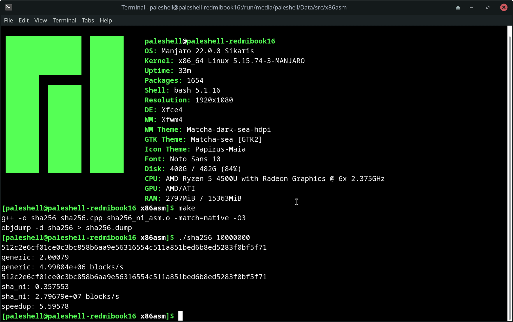

观察 `objdump` 的结果，发现 generic 版本是用 AVX 优化了的。由此可见，使用 SHA 扩展比通用优化的效果要好很多。而如果不进行优化，加速比可达 20 倍以上。

而 sha256-simd 的结果表明，使用 SHA 扩展相比 AVX2 的加速比可达接近 4 倍，而使用 AVX-512 相比 AVX2 的加速比可达 8 倍，暂时无从验证。不过，也许是我写的通用版本还不够优化，比如没有进行内存对齐、循环展开等。

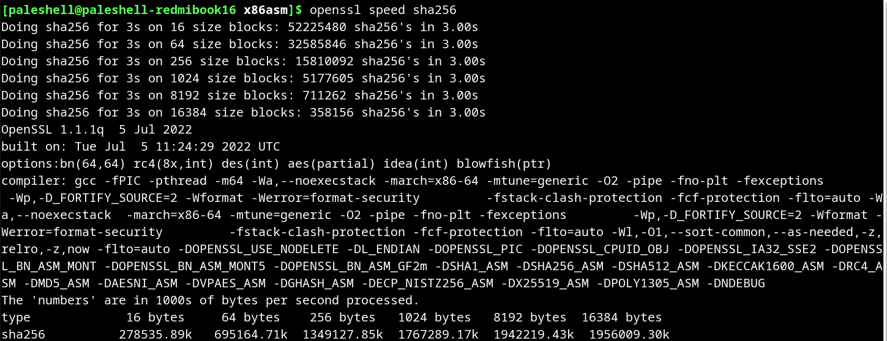

与 OpenSSL 相比，Linux 内核的实现似乎快不少，即使是和 16 字节块进行比较。这我不是很懂。OpenSSL 显示的峰值性能接近 2GB/s，这还只是单线程的，这个速度远大于普通 SSD 的读写速度，所以 CPU 做哈希计算的性能还是很高的。

## 结论

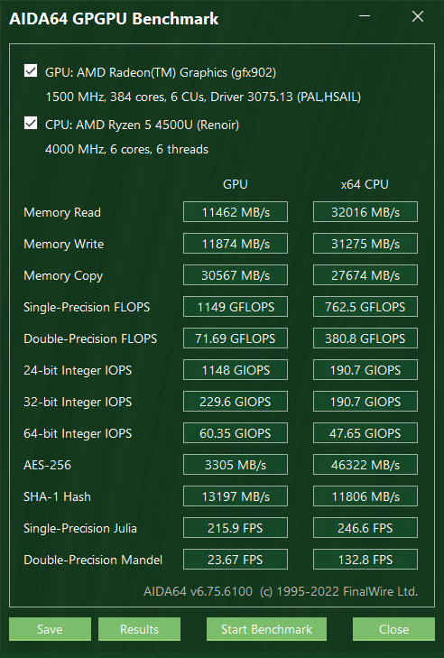

相比之下，使用 AIDA64 GPGPU 测试，核显的性能（参考 SHA-1）也没有高多少，因此在轻薄笔记本或更加低功耗的设备上，使用 CPU 做哈希计算是一个不错的选择。

另一方面，尽管 SHA 扩展在 AVX2 后推出，但是其用到的寄存器却只是 SSE 的，这也许说明了其性能不如更加通用的 AVX-512 的原因。如果能像 AES 扩展后推出 VAES 指令集一样，推出一个 VSHA 指令集，那么性能应该还会有不少提升。以上仅为个人猜测。不过 SHA 的重要性看起来是不如 AES 的，所以这个可能性不大。

# 指令微基准测试

## 简介

本来我就只是想测试一下 SHA 扩展指令的执行效率，主要包括延迟和吞吐率。后来发现这些测试早就有人做了，最主要的就是上面提到的 uops.info 和 [Agner Fog 做的测试](https://www.agner.org/optimize/instruction_tables.pdf)。前者的数据非常丰富，不但包括延迟和吞吐率，还有微指令数、端口占用，以及文档、模拟器和实验的测试结果（如果有），包含的指令也非常全，基本就是批量生成的。后者似乎更加老牌，包含比较老的一些 AMD 处理器，可以做一些交叉对比，两者有一些出入。uops.info 的测试程序就是开源的 nanoBench，也是接下来复现的主要来源。

我找到了三种测定指令的时钟周期数的方法，分别是最传统的 `rdtsc`，直接读取特定型号寄存器（MSR）/性能计数器（PMC） 的 `rdmsr/rdpmc`，以及通过 Linux perf event 测量。其中后两者只能在 Linux 下完成，或者用支持**虚拟化性能计数器**的虚拟机（VMWare 支持，VirtualBox 不支持，Hyper-V 大概也不支持）。Linux perf 显然只能在 Linux 下用，而且 Windows 没有对应工具；Windows 禁止用户程序读取 MSR/PMC，又没提供对应的系统调用。我甚至还尝试写 Windows 驱动来绕过，但即使关了强制签名也没成功；尝试开启 Windows 调试功能，使用 windbg 读取，却只支持读取 MSR，而 AMD 平台 MSR 和 PMC 是严格分离的（就算不分离也没文档说明映射关系），~~反而使我多天后没法启动 Vivado，差点想重装了。~~

为什么不能用高精度计时器呢？比如 Windows 下的 `QueryPerformanceCounter`，或者 C++ 的 chrono 库。主要是 CPU 频率容易发生变化，即使能查询到计算周期数也比较麻烦，下面就提到了即使 `rdtsc` 都会受到主频的影响。

## rdtsc

`rdtsc` 将时钟周期数（时间戳）读入 edx:eax，不管在 Windows 还是 Linux 下都能用，但缺点是精确度和稳定性都不如后面两种方法。有人专门写文章[建议不要用 rdtsc](http://oliveryang.net/2015/09/pitfalls-of-TSC-usage/)，理由包括一些兼容性问题，在多核时代不适合。测试也感觉受操作系统调度影响，波动比较大。nanoBench 支持与 MSR/PMC 一起显示，实际上 TSC 就是一个 MSR。

以下是内联汇编实现：

```cpp
uint64_t rdtsc()
{
	uint32_t lo, hi;
	asm volatile("rdtsc"
				 : "=a"(lo), "=d"(hi));
	return ((uint64_t)hi << 32) | lo;
}
```

## rdpmc

这个就是最复杂的了，AMD 和 Intel 显然是完全不同的，不同代处理器的计数器也可能不同，没有兼容性保证。这里根据 nanoBench 的代码，艰难地还原出了在 AMD Zen 2 上的实现（Zen 架构应该通用）。建议还是直接用 nanoBench，不要自己写。

当 CR4.PCE=1 时，允许用户程序读取 PMC。Windows 就没开，而 Linux 则可以通过 `/sys/devices/cpu/rdpmc` 设置（0 不允许，1 仅允许启用 perf_event 的进程，2 允许所有）。参考 `perf_event_open(2)` 的 manpage，搜索 `rdpmc` 即可。事实上，`perf_event_open` 也是下一种方法的基础。

AMD Zen 架构有 6 个可编程性能计数器，需要写 MSR 配置之后才能工作。也就是说，一次最多只能监测 6 个事件。在 Linux 下需要安装 `msr-tools`，就能在用户模式下读写 MSR。根据 nanoBench 的结果，我找到了最重要的 PMC 事件 LsNotHaltedCyc，也就是时钟周期数。文档参考的是 [AMD PPR](https://developer.amd.com/wp-content/resources/55803_0.78_PUB.pdf)，版本好像不太重要。

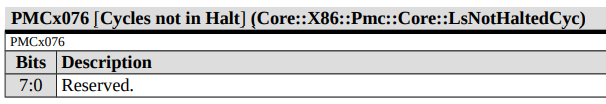

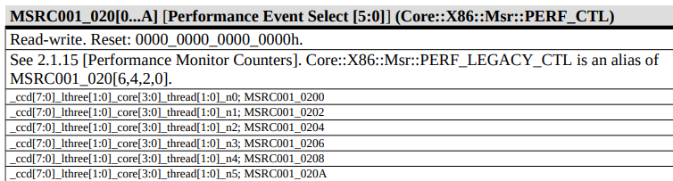

确认 PMC 事件为 x076，需要修改的 MSR 为 0xc0010200，接下来需要确认写入的内容。根据 nanoBench 代码与文档交叉验证，发现需要写入 0x410076。因此只需要执行 `wrmsr 0xc0010200 0x410076` 就可以了，当然这需要 root 权限，可以在程序开始前完成。执行后，PMC 就开始计数了。

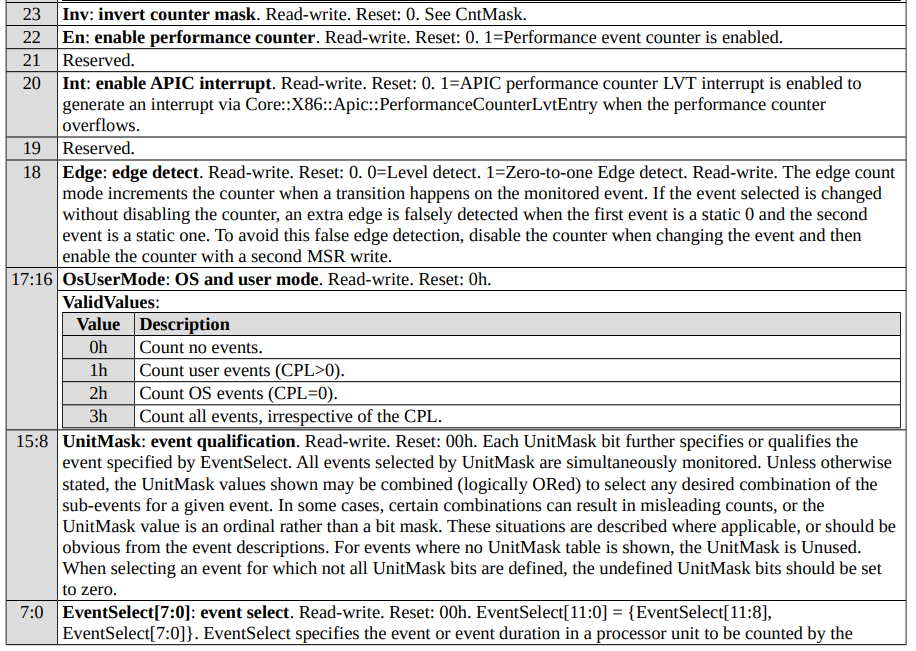

0x410076 的含义是：22 位置 1 表示启用 PMC，17:16 位置 1 表示选择用户模式事件（CPL>0），最低 8 位则是事件编号，其他位都是 0。

接下来真正的 `rdpmc` 就简单了：

```cpp
uint64_t rdpmc(uint32_t counter)
{
	uint32_t lo, hi;
	asm volatile("rdpmc"
				 : "=a"(lo), "=d"(hi)
				 : "c"(counter));
	return ((uint64_t)hi << 32) | lo;
}
```

由于 0xc0010200 对应的是 0 号 PMC，因此 `rdpmc(0)` 就是读取 LsNotHaltedCyc 事件的值。

## perf_event_open

相当于封装了上面 `rdpmc` 的方式，来自 instbench 的代码。事实上，使用 `perf list` 可以列出所有可用的事件，包括上述的 LsNotHaltedCyc。需要将 `/proc/sys/kernel/perf_event_paranoid` 设置为 -1，才能在用户模式下不受限制地使用 `perf_event_open`，否则可能需要 root 权限。仍然参考 `perf_event_open(2)` 的 manpage。

```cpp
int perf_fd = -1;

static int perf_event_open(struct perf_event_attr *hw_event, pid_t pid, int cpu, int group_fd, unsigned long flags)
{
	return (int)syscall(__NR_perf_event_open, hw_event, pid, cpu, group_fd, flags);
}

void init_cycle_counter()
{
	struct perf_event_attr attr;
	memset(&attr, 0, sizeof(attr));

	attr.type = PERF_TYPE_HARDWARE;
	attr.size = sizeof(attr);
	attr.config = PERF_COUNT_HW_CPU_CYCLES;
	attr.exclude_kernel = 1;

	perf_fd = perf_event_open(&attr, 0, -1, -1, 0);
	if (perf_fd == -1)
	{
		perror("perf_event_open");
		exit(1);
	}
}
```

成功打开文件之后，直接从 fd `read` 即可获得 PMC 的值。

## 测试

在 uops.info 上，选定 Zen 2，发现每条指令都测试了寄存器和内存的版本。在上面的实现中，显然一直都是用寄存器的，而且内存测量肯定不太稳定，因此这里主要关注寄存器版本。而且由于这些指令依赖比较少，先关注吞吐率。其中 `SHA256RNDS2` 比较慢，给出的吞吐率是 2 周期，尝试进行验证。

uops.info 上的[测试](https://www.uops.info/html-tp/ZEN2/SHA256RNDS2_XMM_XMM-Measurements.html)非常全面。为了防止循环变量造成影响，一般采用循环展开，或者不循环。仅 `SHA256RNDS2` 一条指令，就进行了**十多个测试**，而且每个都给出了对应的 nanoBench 命令行用于复现。我最终选定了用到 13 个 xmm 寄存器，每次循环 11 条指令的版本，进行测试。

测试指令如下：

```
   0:	0f 38 cb ca          	sha256rnds2 xmm1,xmm2,xmm0
   4:	0f 38 cb da          	sha256rnds2 xmm3,xmm2,xmm0
   8:	0f 38 cb e2          	sha256rnds2 xmm4,xmm2,xmm0
   c:	0f 38 cb ea          	sha256rnds2 xmm5,xmm2,xmm0
  10:	0f 38 cb f2          	sha256rnds2 xmm6,xmm2,xmm0
  14:	0f 38 cb fa          	sha256rnds2 xmm7,xmm2,xmm0
  18:	44 0f 38 cb c2       	sha256rnds2 xmm8,xmm2,xmm0
  1d:	44 0f 38 cb ca       	sha256rnds2 xmm9,xmm2,xmm0
  22:	44 0f 38 cb d2       	sha256rnds2 xmm10,xmm2,xmm0
  27:	44 0f 38 cb da       	sha256rnds2 xmm11,xmm2,xmm0
  2c:	44 0f 38 cb e2       	sha256rnds2 xmm12,xmm2,xmm0
```

xmm0 是隐含寄存器，也可以不写。从机器码可以发现，xmm 编号从 8 开始指令就会有 0x44 前缀，有点像上课讲的 64 位模式寄存器扩展前缀。另外，这些指令避免了任何依赖，因此可以测试**吞吐率**。如果让每条指令都依赖前一条指令，就可以测试**延迟**。

nanoBench 提供了内核和用户两种模式，内核模式需要编译并加载内核模块，之前尝试了发现笔记本会死机，因此还是用用户模式测试。nanoBench 需要 root 权限，并且用 shell 脚本启动，其选项也非常复杂。这里主要关注初始化指令、测试指令、测试次数、监测事件等参数。其中监测事件显然与型号有关，需要从 config 目录下选择对应微架构的文件。最后结合 uops.info 的命令，得到如下的脚本。

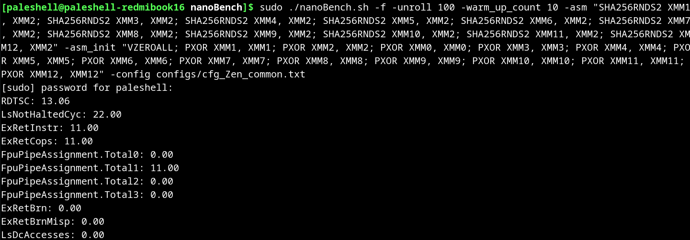

只关注 LsNotHaltedCyc，22.00/11=2.00，符合 uops.info 上的测试结果。RDTSC 的结果就差的有点离谱。我还测试了其他命令，都与 uops.info 上的测试结果完全一致。因此，我认为 uops.info 上的测试结果是可靠的。

我用自己实现的三种方式进行测试，不过需要用 AT&T 语法。一开始忘记了这一点，导致测试结果恰好是两倍，因为将两个操作数反过来就产生了完全的依赖，测试的就是延迟，而 `SHA256RNDS2` 的延迟恰好是 4 周期。

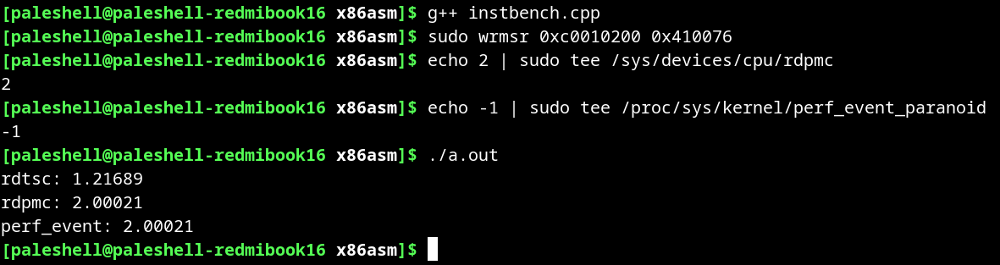

可以发现 `rdpmc` 的结果和 `perf_event` 的结果完全一致，而 `rdtsc` 仍然很不准。大概算了一下，两者的比值比较接近睿频（AMD 其实只叫 Boost 频率，但是 Intel 的睿频比较深入人心）与基频的比值，因此我认为 `rdtsc` 也许计算的是基础频率时钟数，也可能有操作系统的影响。

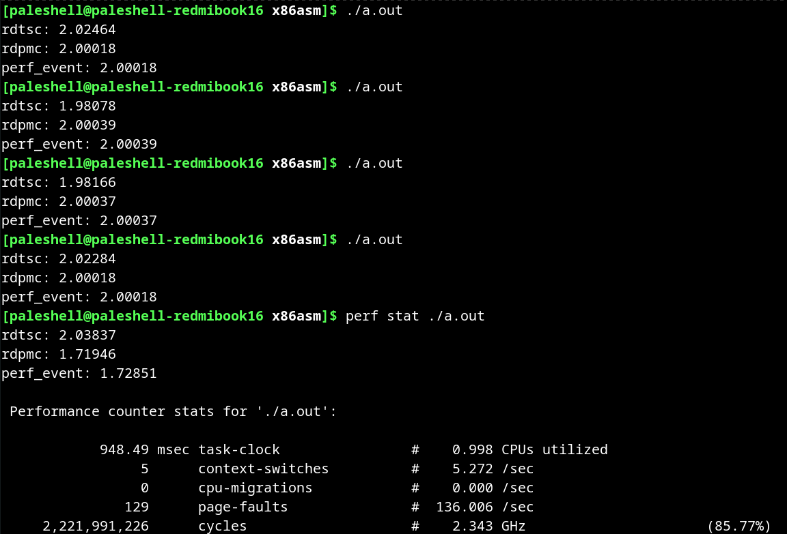

为了验证这个猜想，我拔掉电源进行了测试，发现此时 `rdtsc` 的结果就比较接近 `rdpmc` 的结果。而且用 `perf stat` 发现 CPU 频率确实接近基础频率，也就是说用电池时基本不会进行睿频。而 `perf stat` 下的结果不太正确，可能是两者都在读取 PMC，导致 PMC 的值不准确。

我还做了另一个验证，在 Windows 下，用 Ryzen Controller 可以调整 CPU TDP，来实现（小幅）超频和（大幅）降频。将 TDP 拉到 5W，CPU 频率降到 1.38GHz，此时 `rdtsc` 的结果就快接近 3 了。

# 总结

在本次实验中，我从 SHA 扩展出发，学习了一些密码学、汇编链接以及测定指令周期数的方式，还发现至少 AMD 平台下 `rdtsc` 是不可靠的。尽管对指令的研究还不是特别深入，而且基本都是复现，但我感觉还是学到了不少内容。Linux 就是比 Windows 更加适合做这种实验，因此之前努力折腾 Windows 确实有点浪费时间。

我本来想在更多的平台上测试，但云服务器一般用虚拟机，共享集群没有 root 权限，因此不支持 `rdpmc` 或者 perf。而线下只有计网实验室的 11 代 Intel 支持 SHA 扩展，但最近大家都在做实验，我就没找到机会去测试了。我还找同学借了笔记本，但最终由于未知的原因，nanoBench 没能正常运行，因此也没有测试结果。

于是，我找了 uops.info 上对应的数据，进行简单分析：

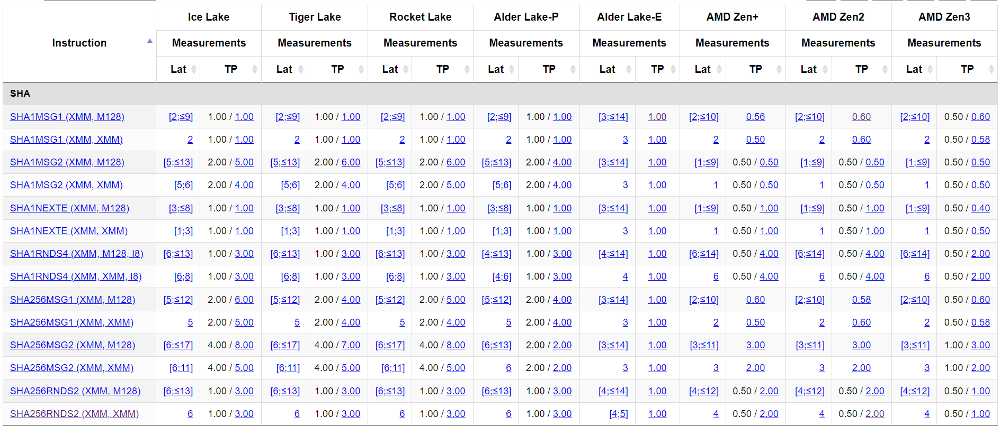

可以发现，AMD 的实现似乎比 Intel 的效率高，不过 Alder Lake-E 属实有点逆天，理论性能似乎是最高的，不过 E 核的频率一般不高。实际上，Alder Lake-E 很多指令都比其他架构快，不知道是不是测试错误。

参考文献已经在正文中给出，这里就不再赘述了。
