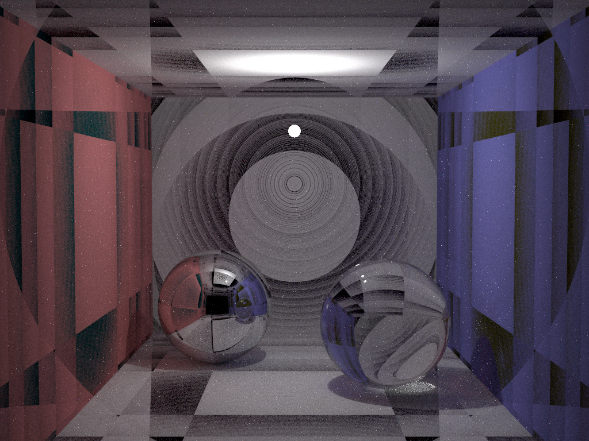
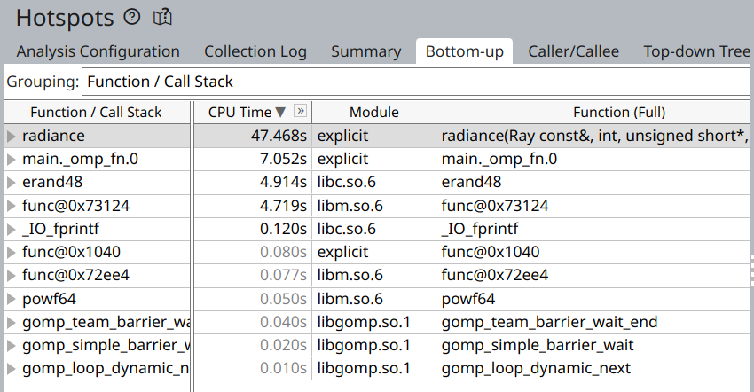
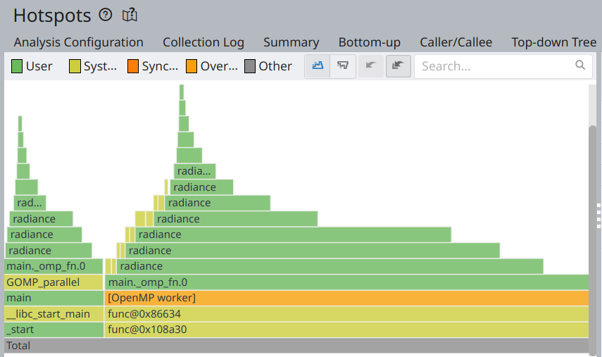
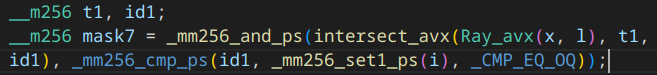
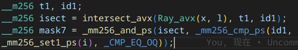
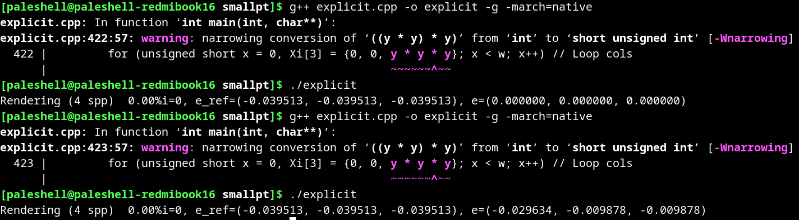
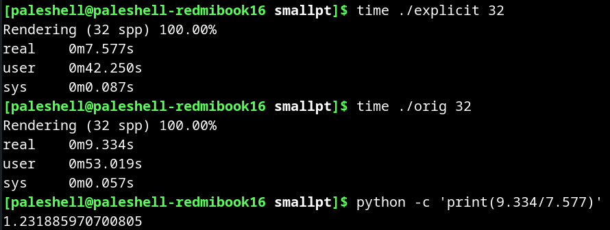
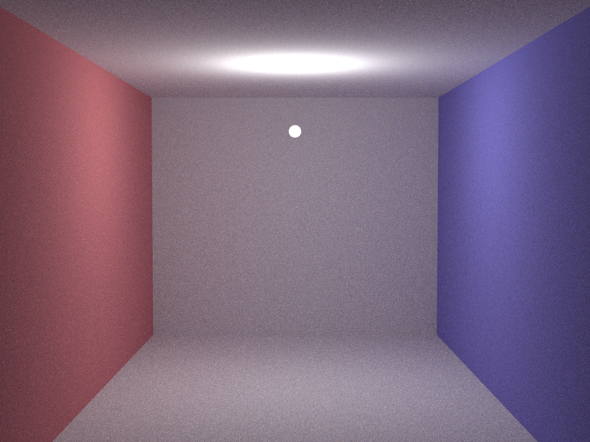
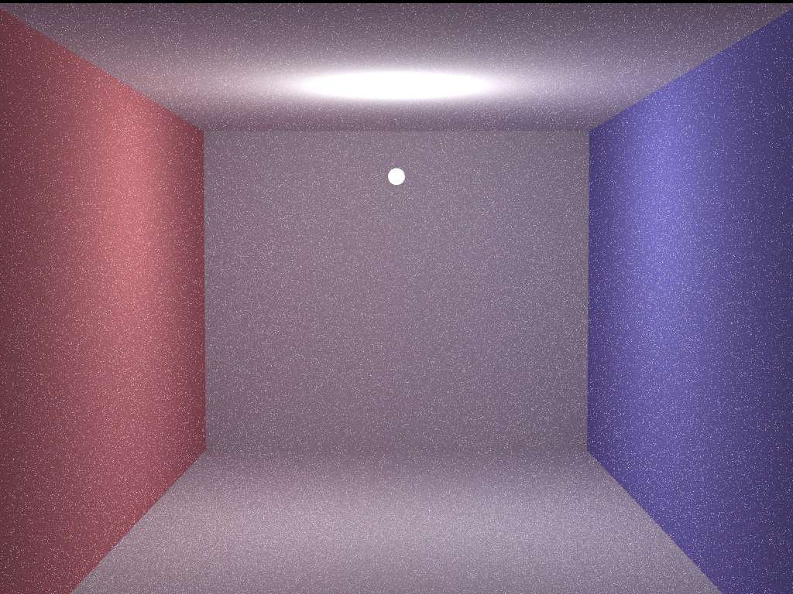

# 前言

上一次实验让我受够了密码学，虽然这次也可以实现 SIMD 优化 SHA-256，但是我还是想换个方向。正好我也在学习图形学，而图形学中运算量最大的算法之一就是路径（光线）追踪，于是我选择了 AVX 优化 smallpt。

路径追踪在图形学中是一个非常重要的技术，渲染效果比光栅化要好很多，可以实现全局光照、反射、折射、软阴影等效果。由于路径追踪采用蒙特卡洛方法，对于每个像素需要发出很多条光线，因此计算量非常大，所以需要对路径追踪算法进行优化。除了可以在 GPU 上实现高并行度的优化之外，在 CPU 上使用 SIMD 优化是不是也比较有效呢？

本次实验使用比较普及的 AVX 指令集，因此向量化长度为 256 位，即 8 个单精度浮点数。~~还是没有 AVX-512 的硬件条件~~

# smallpt

路径追踪涉及各种数学和图形学内容，我们通常认为路径追踪算法是很复杂的。然而，[smallpt](http://www.kevinbeason.com/smallpt/) 的作者 Kevin Beason 只用了 99 行 C++ 代码就实现了一个简单的路径追踪全局光照渲染器。这个渲染器的渲染效果如下图所示：


这个场景是著名的 Cornell Box 的变体，整个场景都由球体组成，包括前后左右上下的墙壁（直径非常大的球看起来很平面差不多），因为 smallpt 只支持渲染球体。

尽管上面的渲染效果看起来很好，但这其实花了很长时间才渲染出来的。例如，在 Core 2 上用了 10 小时多才渲染完成。因此，我选择了 smallpt 的改进版本，最主要的改进是使用了显式光线采样，也就是网站上提到的 `explicit.cpp`。这个改进效果很好，只需要 32 spp（每像素光线/采样数）结果就还行了，几百 spp 应该就能和上面的差不多。

另外，为了提高 SIMD 优化的效果，我把原先的双精度浮点数改成了单精度浮点数，但在光线求交部分仍然使用了双精度浮点数。否则会出现精度问题，导致最终结果很差。



另一个有趣的版本是 [smallptGPU](http://davibu.interfree.it/opencl/smallptgpu2/smallptGPU2.html)，用的是 OpenCL 实现，但代码相当复杂，而且使用了很多过时的 API，我没法成功编译。但 Windows 可执行文件运行效果很不错。

# 优化过程

## 思路

首先，我最容易想到的优化是把 `Vec` 类直接 SIMD 化，但[这篇文章](https://aras-p.info/blog/2018/04/10/Daily-Pathtracer-Part-7-Initial-SIMD/)指出，这样做会导致很多问题，例如：

- SIMD lane 是 2 的倍数，而代码中用到的是 vec3，就会导致浪费 25% 的 lane
- 并不是所有 `Vec` 类运算都能很容易 SIMD 化，有一些优化可能会导致性能下降
- 代码中大部分还是使用标量运算，SIMD 的部分只是少数，根据 Amdahl 定律，这样的优化效果不会很好

因此，我听从建议，选择了另一种思路，即把 `Ray` 类 SIMD 化，也就是同时计算 8 条光线。

## Profiling

在正式开始优化之前，我决定大概了解一下程序的性能瓶颈。首先我尝试了 gprof，不过结果有些混乱。后来我就选择了专业的 Intel VTune，虽然我用的是 AMD CPU。结果如下：





显然，计算 radiance 的过程是最耗时的，这也符合预期，因为这是实际路径追踪的函数。

## 向量化 `Vec` 类

我们自底向上完成向量化。首先是将 `Vec` 类向量化为 `Vec_avx` 类。根据上文，我们不是将 x, y, z 分量打包，而是让每个分量成为一个向量。也就是

```cpp
struct Vec_avx
{
    __m256 x, y, z;
}
```

除了实现 `Vec` 支持的所有方法，我还额外实现了 `blend` 方法，用于选择结果向量中每个分量来自于哪个向量。这个方法会和 `_mm256_blendv_ps` 一样常用。

```cpp
	Vec_avx blend(const Vec_avx &b, __m256 mask) const
    {
        return Vec_avx(_mm256_blendv_ps(x, b.x, mask), _mm256_blendv_ps(y, b.y, mask), _mm256_blendv_ps(z, b.z, mask));
    }
```

此外，由于在光线求交的时候需要使用双精度，因此我还额外实现了 `Vec_avx` 类的 `double` 版本 `Vec_avxd`。因为使用的指令不同，不能使用模板。

## 向量化求交

`Ray` 类的向量化很简单，直接将 `o` 和 `d` 都用 `Vec_avx` 类即可。下一个实际的工作是单个球体与 8 条光线求交。这里比较复杂，因为求交需要使用双精度，每次处理 4 条光线，需要分两次完成计算。

同时从这里开始就需要处理分支了。我逐渐了解到，需要通过 mask 来选择满足条件的光线，在计算完分支的两部分后再通过 blend 来合并结果。这种方式一开始感觉比较奇怪，但写的多了也就习惯了。

```cpp
    __m256 intersect_avx(const Ray_avx &r) const
    {
        __m256 ret;
        for (int i = 0; i < 2; i++)
        {
            Vec_avxd od(r.o, i), dd(r.d, i);
            Vec_avxd op = Vec_avxd(p) - od; // Solve t^2*d.d + 2*t*(o-p).d + (o-p).(o-p)-R^2 = 0
            __m256d t, eps = _mm256_set1_pd(1e-4), b = op.dot(dd), det = b * b - op.dot(op) + _mm256_set1_pd(rad * rad);
            __m256d mask = _mm256_cmp_pd(det, _mm256_setzero_pd(), _CMP_LT_OQ);
            det = _mm256_sqrt_pd(det);
            __m256d mask2 = _mm256_cmp_pd(b - det, eps, _CMP_GT_OQ);
            __m256d mask3 = _mm256_cmp_pd(b + det, eps, _CMP_GT_OQ);
            __m256d ans = _mm256_blendv_pd(_mm256_blendv_pd(_mm256_setzero_pd(), b + det, mask3), b - det, mask2);
            ans = _mm256_blendv_pd(ans, _mm256_setzero_pd(), mask);
            ret = _mm256_insertf128_ps(ret, _mm256_cvtpd_ps(ans), i);
        }
        return ret;
    }
```

`_mm256_cvtpd_ps` 用于将 4 个双精度浮点数转换为 4 个单精度浮点数，`_mm256_insertf128_ps` 用于将 4 个单精度浮点数插入到 `__m256` 的低位或高位。

接下来另一个函数处理了 8 条光线与所有球体的求交，并从中选出每条光线最近的作为最终交点。用到的向量化方式与上面的类似，并调用了上面的函数，不再赘述。

## 向量化 radiance

这是整个程序的核心部分，需要先向量化一些辅助函数。首先是 8 条光线交点有 8 个相交的球（不同光线相交的球可能相同），为了后面向量化方便，我们将这 8 个球也打包成向量，以此构建了 `Sphere_avx` 类：

```cpp
struct Sphere_avx
{
    __m256 rad;      // radius
    Vec_avx p, e, c; // position, emission, color
    __m256 refl;     // reflection type (DIFFuse, SPECular, REFRactive)
    Sphere_avx(__m256 id)
    {
        for (int i = 0; i < 8; i++)
        {
            int idx = (int)id[i];
            rad[i] = spheres[idx].rad;
            p.x[i] = spheres[idx].p.x;
            p.y[i] = spheres[idx].p.y;
            p.z[i] = spheres[idx].p.z;
            e.x[i] = spheres[idx].e.x;
            e.y[i] = spheres[idx].e.y;
            e.z[i] = spheres[idx].e.z;
            c.x[i] = spheres[idx].c.x;
            c.y[i] = spheres[idx].c.y;
            c.z[i] = spheres[idx].c.z;
            refl[i] = spheres[idx].refl;
        }
    }
};
```

另外需要实现的是生成随机向量、随机角度三角函数。使用的随机数是 `erand48`，该函数仅在 Linux 下存在，返回 [0, 1) 的双精度浮点数。由于没有向量化的三角函数（实际上对每个分量计算也影响不大），我采用了先随机生成余弦值，再通过开方计算正弦值。随机三角函数的向量化实现如下：

```cpp
inline void erand48tri(unsigned short *Xi, __m256 &c, __m256 &s)
{
    c = erand48v(Xi) * 2 - 1;
    __m256 sign = _mm256_cmp_ps(erand48v(Xi), _mm256_set1_ps(0.5), _CMP_LT_OQ);
    s = _mm256_sqrt_ps(1 - c * c);
    s = _mm256_blendv_ps(s, -s, sign);
}
```

`radiance` 本身向量化最大的难点是其具有较多的分支，而且还有递归调用。随着递归层数 `depth` 的增加，需要继续计算的光线数量也会减少（每次递归只有符合特定条件，并且通过俄罗斯轮盘赌的光线才会继续计算），因此我想到函数需要增加一个 `mask` 参数，表示有效的光线掩码。

值得注意的是，程序中的 `mask` 基本上都是通过 `_mm256_cmp_ps` 生成的，每个逻辑值有 32 位，只有全 0 或者全 1 是合法的。因此，如果需要手动生成掩码，通常需要用 256 位整数向量来表示，并将逻辑 1 设为 0xffffffff，逻辑 0 设为 0x00000000。因为 0xffffffff 对应的是 -nan，没法直接生成字面量。

递归的退出条件是 `mask` 变为空，表示没有光线需要计算了。显然，在很多循环中，计算的光线数都小于 8 但不为 0，向量化的效率有待提高。

在 main 函数中，每个像素的采样数由外循环 2x2 subpixel 和内循环的采样数决定，因此 spp 必须是 4 的倍数。而我的向量化需要内循环每次采样 8 条光线，因此 spp 就需要是 32 的倍数。虽然这样降低了灵活性，但是代码写起来更简单了。spp 为命令行第一个参数，如果不指定默认为 4。

# 调试与测试

在写完代码后，进行了大量的调试，但最终还是只有漫反射材质能比较正常地渲染，其他材质会莫名其妙的无限递归。调试的主要方法是将向量化版本与相同输入，使用参考版本计算的结果进行比较，从而找到了一些问题。现在测试都是通过的，但是还是只有漫反射材质能正常渲染。

调试过程中也遇到了很奇怪的优化问题，其中一个如下图所示。







可以看到，修改前后的代码逻辑是一样的，只是表达式单独进行了赋值，但是运行结果却不一样。这个问题在调试过程中遇到了很多次，但是都没有找到原因。最后只能通过修改代码来解决。

**部分**调试代码仍然存在于代码中，可以看到调试的工作量远大于代码的编写。

测试表明，向量化版本的性能提升在 20% 左右。效率低的主要原因就是上面提到的 SIMD lane 浪费的问题。



以下为参考版本和优化版本的渲染结果比较，可以发现优化版本有额外的噪点，但我没能找到原因。





# 总结展望

对于 SIMD lane 浪费的问题，需要从根本上改变代码结构。结合体系结构动态调度的思想，首先将 `radiance` 改成只进行一轮操作，并维护一个光线 FIFO，当有至少 8 条光线时进行一轮操作，并将输出的光线放入 FIFO 中。这样就可以保证每个 SIMD lane 都有光线需要计算，不会浪费。同时需要维护光线的递归层数、递归返回计算方法等信息，可能需要建立树型结构存储递归调用关系等，非常复杂。

在本次实验中，我练习了向量化优化，这和 CUDA、OpenCL 等 SIMT 并行编程方式还是有比较大的差距的。SIMD 不能任意寻址，分支也必须把两部分都做完选择结果，是比较有局限性的。

# 参考资料

- [smallpt](http://www.kevinbeason.com/smallpt/)
- [Intel Intrinsics Guide](https://www.intel.com/content/www/us/en/docs/intrinsics-guide/index.html)
- [x86 Intrinsics Cheat Sheet](https://db.in.tum.de/~finis/x86%20intrinsics%20cheat%20sheet%20v1.0.pdf)
- [Algorithmica / HPC](https://en.algorithmica.org/hpc/simd/intrinsics/)
- [ToyPathTracer](https://aras-p.info/blog/2018/04/10/Daily-Pathtracer-Part-7-Initial-SIMD/)
